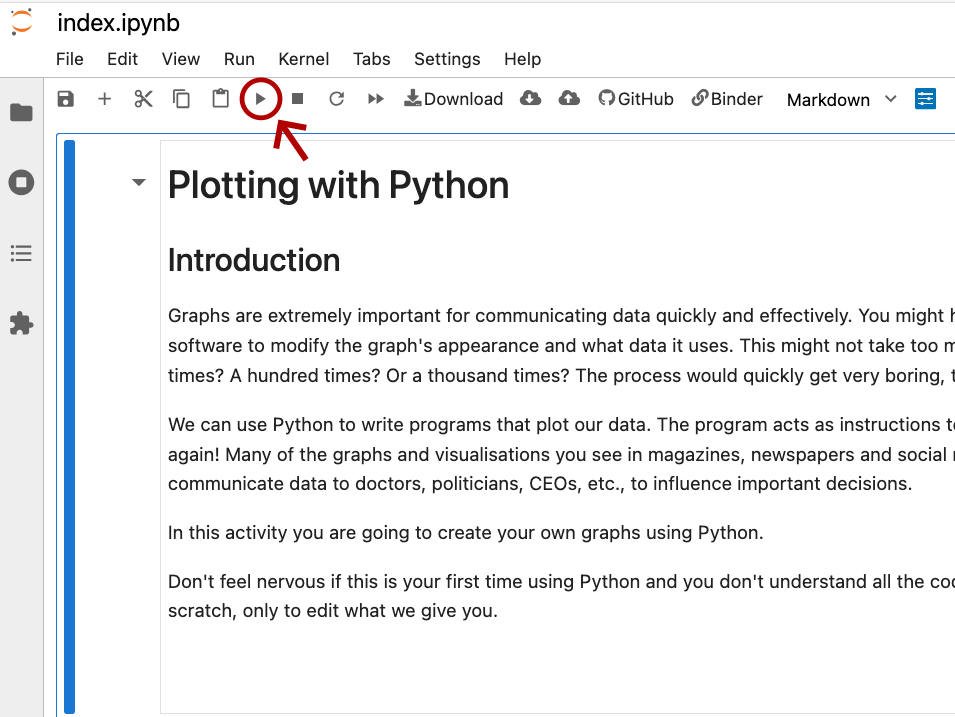

# Introduction

## Before beginning

::: {.callout-tip appearance="simple"}
## Attention!

Please open [this link](https://hub.2i2c.mybinder.org/user/cbflivuni-animal_ageing-nlzxd844/doc/workspaces/auto-s/tree/index.ipynb) **in a new tab** and let it load, this may take a few minutes.
:::

This is a short interactive programming activity where you'll learn how to create plots using Python, in a real-life programming environment known as a **Jupyter notebook**. The session should run 60-90 minutes total.

## General guidance and tips

-   Take your time and read all the instructions on this page and the following pages - if you skip forward you may miss *important information that can help you later*
-   You'll be copying and pasting bits of code into the notebook to see what they do:
    -   To **copy**: highlight the code and press 'ctrl' + 'C' on your keyboard
    -   To **paste:** use 'ctrl' + 'V'

## Running the code

Below is an example code block for you to try. To copy the code, you can either:

-   Highlight it and copy as described above, **or**
-   Hover over the block and click the 📋 **clipboard icon** that appears to the right.

Try copying the code block below.

```{python}

print("I am a Python code block.")

```

Once you've copied the code, switch to your Jupyter notebook (which you should have open in another tab). Paste the code into a **code cell**, then run the cell by either:

- Clicking the ▶️ **play button** (see image below), or
- Pressing **Shift + Enter** on your keyboard.

<br>

<center></center>

<br>
